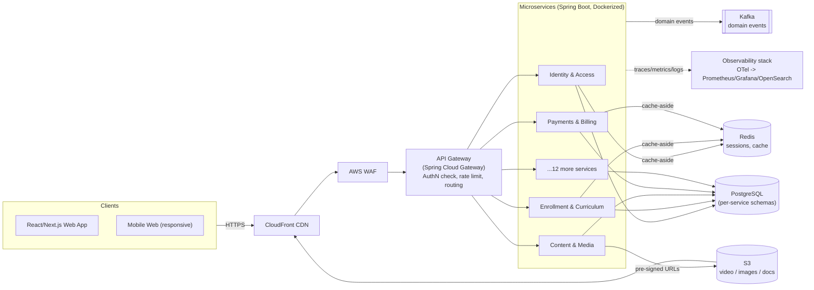
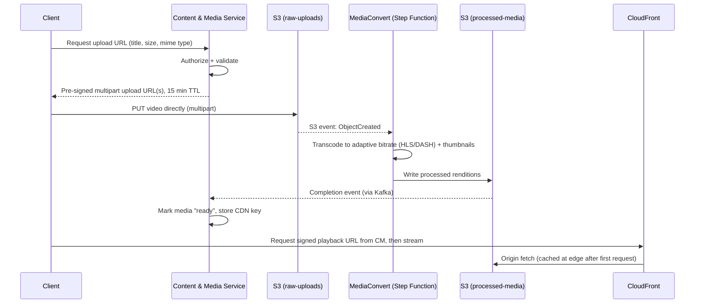
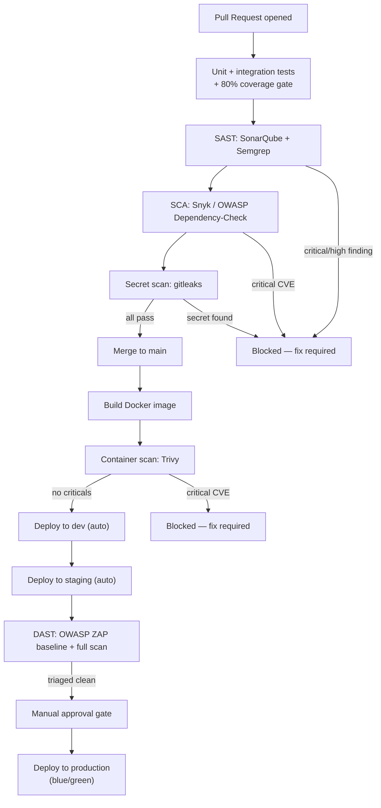
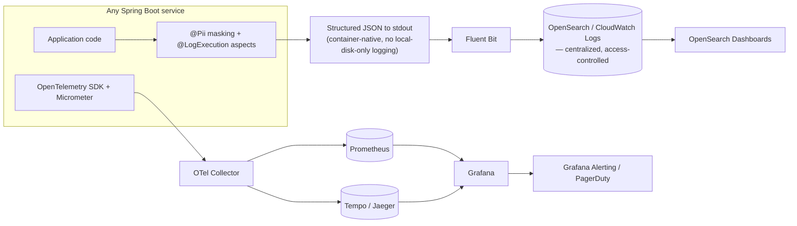

# IvySchool.ai — Platform Architecture & Delivery Plan

**Status:** Draft v1.0 · **Owner:** Engineering · **Last updated:** 2026-08-18

This document is the reference architecture for ivyschool.ai — the marketing site and the learning
application behind it. It is organized so each concern can be reviewed and evolved independently:
architecture design, codebase standards, database, storage, security, testing, application security
testing, logging/observability, and deployment. Section 12 collects the non-negotiable data-handling
boundaries called out explicitly in the product brief.

---

## 1. Executive Summary

IvySchool.ai connects students to courses and credentials from partner universities (Harvard, MIT,
Stanford, Wharton) through an AI-personalized learning experience. Ten distinct personas (Admin,
Student, Teacher, School Admin, Parent, Guest, Course Provider, Sales, Marketing, School Staff) share
one platform with very different privilege levels — which makes **authorization design, not just
authentication, the central security problem.**

Architectural bets this document commits to:

| Decision | Choice | Why |
|---|---|---|
| Frontend | React via **Next.js** | SSR/SEO for the public marketing site, SPA-grade interactivity for the app, still plain React |
| Backend | **Java 21 + Spring Boot 3** microservices | Team's stated stack; mature ecosystem for security, AOP, resilience |
| Database | **PostgreSQL** (Aurora), database-per-service | Strong consistency where it matters, blast-radius isolation between domains |
| Messaging | **Kafka** (MSK) for domain events | Decouples services, enables the audit/analytics/notification fan-out |
| Media | **S3 + CloudFront + MediaConvert** | Durable, cheap-at-scale storage with adaptive-bitrate delivery |
| Cache | **Redis** (ElastiCache) | Sessions, permission lookups, catalog reads, rate-limit counters |
| Containers | **Docker** images, orchestrated on **ECS Fargate** (path to EKS) | Docker as the deployable unit, managed scheduling to start |
| Security | Password + CAPTCHA + MFA, layered RBAC, KMS encryption everywhere | Defense in depth across ten personas and minors' data |
| Testing | 80% coverage gate, JUnit5/Testcontainers/Playwright | Enforced in CI, not aspirational |
| AppSec | SAST + SCA + secret scanning + container scan + DAST, all CI gates | Shift-left, block on critical findings |

---

## 2. Personas & Access Model

| Persona | Primary goals | Sensitive data touched |
|---|---|---|
| **Admin** | Platform configuration, tenant oversight, global RBAC | Broadest access — highest-privilege account, MFA mandatory |
| **Student** | Enroll, learn, submit work, pay | Own PII, payment method token |
| **Teacher** | Author courses, grade, message | Roster PII (own classes only) |
| **School Admin** | Manage a school's staff/students/billing | Org-scoped PII across their tenant |
| **Parent** | Monitor a minor's progress, manage consent & billing | Child's PII — **COPPA-relevant** |
| **Guest** | Browse public catalog/marketing | None (unauthenticated) |
| **Course Provider** | Publish content, view revenue/engagement | Content + licensing + revenue-share data |
| **Sales Team** | Manage leads and contracts (CRM) | Prospect/customer contract PII |
| **Marketing Team** | Campaigns, CMS, analytics | Mostly aggregate data, some lead PII |
| **School Staff** | Operational tasks (attendance, scheduling) | Student PII, scoped by assigned role |

This table is the seed for the RBAC permission matrix in §7.2. Because Parent/Student personas may
include minors, **age-aware consent and data-minimization are first-class requirements, not an
afterthought** — see §7.4.

---

## 3. Architecture Design

### 3.1 System context



**Key decisions**

- **Everything public and authenticated goes through CloudFront.** Static assets and media are cached
  at the edge; API traffic passes through but still benefits from WAF and connection reuse.
- **One API Gateway, many services.** The gateway owns JWT validation, coarse route-level authorization,
  and rate limiting. Fine-grained authorization lives in each service (§3.5, §7.2).
- **Media never transits application servers.** Clients upload to and stream from S3/CloudFront
  directly using short-lived pre-signed URLs — app servers only issue and validate those URLs.

### 3.2 Service decomposition

Domain-driven bounded contexts, each an independently deployable Spring Boot service with its own
Postgres schema:

| Service | Responsibility | Primary data |
|---|---|---|
| Identity & Access | AuthN, MFA, session/token issuance, RBAC policy evaluation | Hashed credentials, MFA factors, roles/permissions |
| User Profile | Profile data for every persona | Names, contact info, preferences |
| Tenant / School Mgmt | School org hierarchy, multi-tenancy | Org units, billing entity links |
| Course Catalog | Course/program metadata, partner university content | Course metadata, partner licensing terms |
| Enrollment & Curriculum | Enrollment, progress, learning paths | Enrollment records, progress state |
| Content & Media | Upload orchestration, media metadata, transcoding triggers | Media metadata, S3 object refs |
| Assessment & Grading | Quizzes, assignments, gradebook | Submissions, grades |
| Live Class & Scheduling | Calendar, live session management | Schedule, session join records |
| Messaging & Notification | Email / SMS / push / in-app delivery | Templates, delivery logs |
| Payments & Billing | Subscriptions, invoices, processor integration | Processor tokens, invoices — **no raw card data** |
| Certification | Certificate issuance & public verification | Certificate records |
| Analytics & Reporting | Learning analytics, dashboards | Aggregated/derived metrics from the event bus |
| CRM / Sales | Leads, pipeline, contracts | Prospect/customer PII |
| Marketing / CMS | Public site content, campaigns | CMS content, campaign metadata |
| Search | Full-text course/content search | Search index (OpenSearch) |
| Audit & Compliance | Immutable audit trail | Append-only audit events |

Services communicate synchronously (REST via the gateway or internal mTLS) for request/response needs
and asynchronously (Kafka domain events) for anything that fans out — e.g. `EnrollmentCreated` is
consumed by Notification, Analytics, and Audit without those services being coupled to Enrollment.

### 3.3 Microservices & resilience patterns

| Pattern | Purpose | Implementation |
|---|---|---|
| Circuit breaker | Stop calling a failing dependency, fail fast | Resilience4j `@CircuitBreaker` |
| Retry with backoff + jitter | Absorb transient failures | Resilience4j `@Retry` |
| Bulkhead | Isolate thread pools per dependency so one slow downstream can't starve others | Resilience4j `@Bulkhead` |
| Timeout | Bound latency of every downstream call | Resilience4j `@TimeLimiter` |
| Rate limiting | Protect services from overload/abuse | Gateway-level + Resilience4j `@RateLimiter` |
| Idempotency keys | Prevent duplicate side effects on retried writes | `Idempotency-Key` header + dedup table (Payments, Enrollment) |
| Graceful degradation | Serve cached/stale data instead of a hard failure | Redis cache-aside + feature flags |
| Health checks | Let the orchestrator route around / replace unhealthy instances | Spring Boot Actuator `/health/liveness`, `/health/readiness` |

All defaults for these patterns live in a shared `ivy-resilience-starter` library (§4.2) so every
service gets sane timeouts and circuit breakers without reimplementing them.

### 3.4 Observability pattern

Every service is instrumented identically via a shared starter, so traces, metrics, and logs are
comparable across the whole platform on day one rather than bolted on service-by-service later. Full
pipeline detail is in §10.

### 3.5 Aspect-oriented cross-cutting concerns

Spring AOP/AspectJ centralizes the concerns that would otherwise be copy-pasted (or forgotten) in every
controller and service method — this is also how the **"no PII in logs" and "every sensitive action is
audited" boundaries (§12) are enforced mechanically instead of by convention.**

| Aspect / annotation | Concern | Trigger |
|---|---|---|
| `@Auditable` | Writes an immutable audit event (who, what, before/after, when) | Role changes, grade changes, PII export/delete, refunds |
| `@LogExecution` | Structured entry/exit + duration logging with correlation IDs | Any method opted in |
| `@Pii` (field annotation) + logging converter | Redacts annotated fields before they ever reach a log appender | Applied to DTO fields at declaration time |
| `@PreAuthorize` + tenant-scope aspect | Method-level RBAC and row-level tenant scoping | Every service method touching persona-owned data |
| `@Cacheable` / `@CacheEvict` | Redis-backed caching | Catalog reads, permission lookups |
| `@RateLimited` | Per-user / per-IP throttling | Auth endpoints, expensive queries |
| `@Timed` | Micrometer metrics emission | Service-layer methods |
| `@Transactional` + outbox | Atomic DB write with reliably-published domain event | Any state change that also emits an event |

Because `@Pii` redaction and `@Auditable` are aspects rather than inline code, a developer cannot
accidentally log a raw field or skip an audit entry without also removing the annotation — which is a
visible, reviewable diff.

### 3.6 API & integration design

- REST over HTTPS, versioned by URI (`/v1/...`); GraphQL is not adopted for v1 to keep the security
  model (per-field authorization) simpler — revisit only if BFF aggregation pain justifies it.
- OpenAPI 3 generated from code (`springdoc-openapi`); the spec is the source of truth for client SDKs
  and contract tests.
- Errors follow RFC 7807 `application/problem+json` — no stack traces or internal exception messages
  ever reach a client response.
- Internal service-to-service calls are authenticated (mTLS or signed service JWT) — **no internal
  endpoint is ever left unauthenticated**, even inside the VPC.

---

## 4. Codebase & Engineering Standards

### 4.1 Repository strategy

A **backend monorepo** (Gradle multi-module) at launch: one repo, one module per microservice, plus
shared library modules. This keeps cross-service refactors and shared-library versioning cheap while
the team is small; each module still builds and deploys as an independent Docker image, so splitting
into polyrepos later is a mechanical extraction, not a rewrite. The frontend lives in its own repo
(different release cadence, different CI needs).

```
ivy-platform/
  services/
    identity-service/
    user-profile-service/
    enrollment-service/
    content-media-service/
    payments-service/
    ...
  libs/
    ivy-security-starter/
    ivy-observability-starter/
    ivy-resilience-starter/
    ivy-testing-starter/
  infra/                # Terraform
  docker-compose.yml     # full local stack

ivy-web/                 # separate repo: Next.js app
  apps/marketing/
  apps/app/               # authenticated learning app
  packages/design-system/
```

### 4.2 Shared platform libraries

Published as internal Maven artifacts, versioned independently, so a security fix in
`ivy-security-starter` can be bumped across every service without touching business logic:

- **ivy-security-starter** — JWT validation filter, RBAC annotations, `@Pii` masking converter, tenant
  context propagation.
- **ivy-observability-starter** — OpenTelemetry auto-config, structured Logback config, Micrometer
  registry wiring.
- **ivy-resilience-starter** — Resilience4j default policies (circuit breaker, retry, bulkhead) per
  dependency type.
- **ivy-testing-starter** — Testcontainers base classes (Postgres, Redis, Kafka), fixture builders.

### 4.3 Backend standards

- Java 21 (LTS), Spring Boot 3.x, Gradle.
- Layered architecture (controller → service → repository) for simple domains; hexagonal
  (ports/adapters) for domains with real business complexity (Enrollment, Assessment).
- DTOs at every boundary — JPA entities are never serialized directly to a client.
- Bean Validation (`jakarta.validation`) on every inbound DTO.
- Flyway-managed migrations live with the owning service (§5.3).

### 4.4 Frontend standards

- Next.js (App Router) — SSR/SSG for marketing/SEO pages, client-rendered routes for the authenticated
  app.
- Feature-folder structure; shared component library in Storybook (`packages/design-system`).
- Server state via React Query; minimal client state via Zustand/Context — no global Redux store.
- Forms: React Hook Form + Zod schema validation, shared with backend validation rules where practical.
- Accessibility baseline: WCAG 2.1 AA; i18n scaffolding in place from day one given the platform's
  global ambition.

### 4.5 Git & review workflow

- Trunk-based development, short-lived feature branches, required PR review.
- Conventional commits; semantic versioning per service/library.
- `CODEOWNERS` requires a security reviewer on any change under `identity-service/`, `payments-service/`,
  or `ivy-security-starter/`.
- Pre-commit hooks run `gitleaks` (secret scanning) and linting before a commit is even offered to CI.

---

## 5. Database Design

### 5.1 Data ownership model

**Database-per-service** on a shared Aurora PostgreSQL cluster at launch (separate schema + separate
least-privilege DB role per service, so a compromised service credential can't read another service's
data) — graduating individual services to their own cluster as load or compliance needs justify the
cost. No service ever reads another service's tables directly; cross-service data needs go through the
owning service's API or a Kafka-fed read model.

### 5.2 Core schemas (representative, not exhaustive)

```sql
-- identity-service
CREATE TABLE users (
    id              UUID PRIMARY KEY DEFAULT gen_random_uuid(),
    email           CITEXT UNIQUE NOT NULL,
    password_hash   TEXT NOT NULL,           -- Argon2id, never logged
    status          TEXT NOT NULL DEFAULT 'active',
    created_at      TIMESTAMPTZ NOT NULL DEFAULT now()
);

CREATE TABLE mfa_factors (
    id              UUID PRIMARY KEY DEFAULT gen_random_uuid(),
    user_id         UUID NOT NULL REFERENCES users(id),
    factor_type     TEXT NOT NULL,            -- 'totp' | 'sms' | 'email'
    secret_encrypted BYTEA NOT NULL,           -- envelope-encrypted via KMS
    verified_at     TIMESTAMPTZ
);

CREATE TABLE roles (id UUID PRIMARY KEY, name TEXT UNIQUE NOT NULL);
CREATE TABLE permissions (id UUID PRIMARY KEY, code TEXT UNIQUE NOT NULL);
CREATE TABLE role_permissions (role_id UUID REFERENCES roles(id), permission_id UUID REFERENCES permissions(id));
CREATE TABLE role_bindings (
    user_id   UUID REFERENCES users(id),
    role_id   UUID REFERENCES roles(id),
    tenant_id UUID,                          -- NULL for platform-wide roles (e.g. Admin)
    PRIMARY KEY (user_id, role_id, tenant_id)
);

-- audit-service (append-only, partitioned by month)
CREATE TABLE audit_log (
    id           BIGINT GENERATED ALWAYS AS IDENTITY,
    occurred_at  TIMESTAMPTZ NOT NULL DEFAULT now(),
    actor_id     UUID NOT NULL,
    tenant_id    UUID,
    action       TEXT NOT NULL,               -- e.g. 'GRADE_CHANGED'
    resource     TEXT NOT NULL,
    before_state JSONB,
    after_state  JSONB,
    trace_id     TEXT NOT NULL
) PARTITION BY RANGE (occurred_at);
```

`role_bindings.tenant_id` is what makes a School Admin's role scoped to *their* school rather than
global — the same table shape covers a platform-wide Admin (`tenant_id IS NULL`) and a tenant-scoped
Teacher.

### 5.3 Migrations

- **Flyway**, versioned SQL files living inside each service's own module — a service's schema history
  ships with its code, not in a separate DBA-owned repo.
- Migrations run as a pipeline step immediately before the new service version is rolled out.
- **Expand/contract pattern** for zero-downtime schema changes: add the new column/table nullable →
  deploy code that writes both old and new → backfill → deploy code that reads only new → drop the old
  column in a later migration. No deploy ever requires the old and new code to disagree about schema
  shape simultaneously.

### 5.4 Encryption & PII in the database

- **Encryption at rest** is mandatory cluster-wide (Aurora storage encryption, KMS-managed key).
- **Column-level envelope encryption** (application-layer, via AWS KMS `GenerateDataKey`) for the
  highest-sensitivity fields — MFA secrets, a minor's date of birth, government ID if ever collected,
  parent/guardian contact details. These fields are encrypted before the INSERT ever reaches Postgres,
  so even a DB-level breach doesn't expose them in plaintext.
- **Row-Level Security (RLS)** policies enforce tenant isolation as a last line of defense — even if a
  service-layer bug forgot a `WHERE tenant_id = ?`, Postgres itself refuses cross-tenant rows.
- **Least-privilege DB roles**: each service's DB credential can only touch its own schema; there is no
  shared "superuser" application credential.
- **No human production DB access** without a time-boxed, logged break-glass session — routine access
  (support, BI) goes through read replicas with masked views, never the primary.
- A living **data classification dictionary** tags every PII-bearing column (Public / Internal /
  Confidential / Restricted) so new columns get an explicit classification review before merge, not an
  audit finding six months later.

### 5.5 Backup & disaster recovery

- Automated daily snapshots + continuous point-in-time recovery (PITR) via Aurora.
- Cross-region read replica for regional failover.
- Backups encrypted with the same KMS key hierarchy as the primary data.
- Quarterly restore drills — a backup that has never been restored is not a backup.
- Targets: **RPO ≈ 15 minutes** (via PITR), **RTO ≈ 1 hour** for a primary-region failure.

---

## 6. Storage, Caching & CDN

### 6.1 Object storage (S3)

- Separate buckets per data class: `raw-uploads`, `processed-media`, `documents`, `backups`.
- Versioning on; lifecycle rules transition aged raw originals to Glacier and expire incomplete
  multipart uploads automatically.
- **SSE-KMS mandatory** via bucket policy; a bucket policy explicitly denies any public ACL/policy —
  public access is structurally impossible, not just discouraged.
- Clients never upload/download through an application server for large files — they use short-TTL
  **pre-signed URLs** issued by the Content & Media service.

### 6.2 Media pipeline



Access-gated video (a course a student hasn't purchased) is served via **CloudFront signed
URLs/cookies**, not bucket-public objects — entitlement is checked once, at signing time, by the
Content & Media service.

### 6.3 CDN (CloudFront)

- Sits in front of both S3 media and the static/marketing assets from Next.js.
- Signed URLs/cookies for entitlement-gated content; public catalog assets are cached openly for
  performance.
- Standard cache invalidation on content republish; geo-restriction available per partner-university
  licensing terms if a course is region-restricted.

### 6.4 Caching (Redis)

ElastiCache Redis backs the `@Cacheable` aspect (§3.5) for:

- Session/refresh-token metadata and a revocation list (instant logout-everywhere).
- RBAC permission lookups (avoids re-evaluating the full role→permission chain on every request).
- Frequently-read catalog data (cache-aside, TTL + explicit invalidation on publish events).
- Rate-limit counters shared across gateway instances.

---

## 7. Security Architecture

### 7.1 Authentication

- Spring Security; passwords hashed with **Argon2id** (never bcrypt-only, never reversible encryption).
- Password policy: minimum length + breach-list check (HaveIBeenPwned range API) at signup/change —
  reject known-compromised passwords outright.
- **CAPTCHA** (reCAPTCHA v3 / hCaptcha) on signup, login, and password-reset to blunt credential
  stuffing and bot signups.
- **MFA**: TOTP (authenticator app) as the primary factor, SMS/email OTP as fallback. **Mandatory** for
  Admin, School Admin, and Teacher roles; strongly encouraged (and easy to enable) for Student/Parent.
  WebAuthn/passkeys are a near-term enhancement once the TOTP flow is stable.
- Access tokens: short-lived JWT (15 min); refresh tokens rotate and live in `httpOnly`, `Secure`,
  `SameSite=Strict` cookies — never in `localStorage`.
- Account lockout with exponential backoff after repeated failures; new-device/new-location login
  alerts via the Notification service.

### 7.2 Authorization / RBAC

Three enforcement layers, so no single bug is a full bypass:

1. **Gateway** — coarse route-level check (is this JWT valid, does the role even have a route to this
   path).
2. **Service layer** — `@PreAuthorize` + the tenant-scope aspect (§3.5) for fine-grained, row-level
   checks (a Teacher can only grade *their own* roster).
3. **Database** — Postgres Row-Level Security as the last line of defense (§5.4).

Permission matrix (`N`=none, `R`=read, `RO`=read own/scoped, `WO`=write own/scoped, `WT`=write across
own tenant, `F`=full):

| Persona | Platform Config | User/Role Mgmt | School Mgmt | Course Content | Enrollment | Grades | Payments | Analytics |
|---|---|---|---|---|---|---|---|---|
| Admin | F | F | F | F | F | F | F | F |
| School Admin | N | WT | WT (own school) | R | WT (own school) | R (own school) | WT (own school) | WT (own school) |
| Teacher | N | N | R (own school) | WO (own courses) | RO (own roster) | WO (own roster) | N | RO (own classes) |
| Student | N | N | N | R | RO (own) | RO (own) | WO (own) | RO (own) |
| Parent | N | N | N | R | RO (child) | RO (child) | RO (child) | RO (child) |
| Guest | N | N | N | R (public) | N | N | N | N |
| Course Provider | N | N | N | WO (own content) | N | N | R (own revenue) | R (own content) |
| Sales | N | N | N | R | N | N | R (contracts only)¹ | R (pipeline) |
| Marketing | N | N | N | R | N | N | N | R (aggregate only) |
| School Staff | N | N | R (own school) | R | RO (scoped ops) | N | N | R (ops) |

¹ Sales' "Payments" access is scoped to CRM contracts/invoices, never to student payment records.

### 7.3 Encryption

- **In transit**: TLS 1.2+ everywhere, including from CloudFront to origin; internal service-to-service
  traffic authenticated via mTLS or signed service tokens.
- **At rest**: KMS-backed encryption for Aurora, S3 (SSE-KMS), and EBS volumes; envelope encryption at
  the application layer for the highest-sensitivity fields (§5.4).
- **Key rotation**: automatic annual KMS key rotation, plus an on-demand rotation runbook for suspected
  compromise.

### 7.4 PII & regulatory handling

- **Data classification**: Public / Internal / Confidential / Restricted, tagged per field in the data
  dictionary (§5.4); Restricted fields (minors' data, government IDs, MFA secrets) get envelope
  encryption and the tightest access policy.
- **Minors' data**: because Student accounts may belong to children, signup flows detect age and route
  under-13 accounts through a **parental-consent flow** (COPPA), with the Parent persona as the
  account's legal controller until consent/age-out.
- **Educational records**: grade and progress data handled under **FERPA**-aligned access principles —
  only the student, their parent/guardian, and staff with a legitimate educational interest can read
  it, mirrored directly in the RBAC matrix above.
- **Data subject rights**: self-service "download my data" and "delete my account" flows honor
  access/export/erasure requests, with a legal-hold exception for records (e.g. financial) that must be
  retained for compliance.
- **PII minimization**: collect only what a feature actually needs; new PII fields require a
  classification review before merge (enforced via PR template + `CODEOWNERS`).
- **No PII in logs, ever** — mechanically enforced by the `@Pii` masking aspect (§3.5), not just a style
  guideline. No PII in URLs or query strings either.
- **Sub-processor agreements** (DPAs) in place with the payment processor, email/SMS providers, and CDN
  — anyone who touches PII on our behalf is contractually bound to the same standard.

### 7.5 Secrets management

- **AWS Secrets Manager / Parameter Store** for DB credentials, third-party API keys, JWT signing keys —
  injected as environment variables/mounted files at container start, **never baked into an image or
  committed to source**.
- Enforced by `gitleaks` in pre-commit hooks and again as a blocking CI step (§9), plus periodic full
  git-history scans.
- Prefer short-lived credentials: services authenticate to AWS via IAM roles (task roles on
  ECS/EKS), not long-lived static access keys.

### 7.6 Network security

- VPC with private subnets for services and databases; only load balancers/NAT sit in public subnets.
- Security groups are least-privilege and explicit — no wildcard ingress.
- AWS WAF (OWASP core rule set) in front of CloudFront/ALB; AWS Shield for DDoS protection.

---

## 8. Testing Strategy & Coverage

| Layer | Tooling | What it covers |
|---|---|---|
| Unit | JUnit 5 + Mockito (backend), Jest + React Testing Library (frontend) | Business logic in isolation — the bulk of the test suite |
| Integration | Spring Boot Test + **Testcontainers** (real Postgres/Redis/Kafka in CI) | Repository queries, migrations, event publishing — no mocks for the DB |
| Contract | Spring Cloud Contract / Pact | Service-to-service API compatibility, catches breaking changes before deploy |
| End-to-end | Playwright | Critical journeys: signup+MFA, enrollment, video playback, checkout |
| Performance | k6 / Gatling | Load profile on key endpoints ahead of major releases |

**Coverage gate: 80% line + branch coverage, enforced in CI (JaCoCo for backend, Istanbul/c8 for
frontend) — a build that drops below threshold fails, it does not merely warn.** Security- and
payments-critical modules (`identity-service`, `payments-service`, `ivy-security-starter`) carry a
higher bar (90%+) given their blast radius. Coverage trends are tracked centrally (SonarQube/Codecov)
with per-PR diffs so coverage cannot quietly erode over time.

Test data is synthetic (Faker-generated) in every lower environment. Production data is never copied
into a lower environment unmasked; if a prod-like dataset is ever needed for performance testing, it
goes through a masking/subsetting pipeline first.

---

## 9. Application Security Testing (SAST / DAST / SCA)



- **SAST**: SonarQube (code quality + security hotspots) and Semgrep (custom rules for our codebase's
  known risk patterns) on every PR — new critical/high findings block merge.
- **SCA**: Snyk or OWASP Dependency-Check against every Maven/npm manifest; critical CVEs block the
  build. Dependabot/Renovate opens update PRs automatically so this stays low-friction.
- **Secret scanning**: `gitleaks` in pre-commit and again in CI; periodic full-history scans catch
  anything that slipped through before the hook existed.
- **Container scanning**: Trivy scans every built image before it's pushed to the registry; critical
  base-image or dependency CVEs block deployment.
- **DAST**: OWASP ZAP automated baseline scan nightly against staging, full active scan before major
  releases; findings triaged by a security-champion rotation.
- **IaC scanning**: Checkov/tfsec on every Terraform change, catching a misconfigured S3 bucket or
  security group before `apply`.
- **Penetration testing**: annual third-party pentest; bug bounty program considered once public
  traffic justifies it.

---

## 10. Observability & Centralized Logging



- **Every log line is structured JSON** with a fixed field set: `timestamp`, `level`, `service`,
  `trace_id`, `span_id`, `tenant_id`, a pseudonymized `user_id` — never free-text `printf`-style logs in
  production.
- **PII redaction happens at the source**, inside the process, via the `@Pii` masking converter (§3.5) —
  before a log line is ever written to stdout. Nothing downstream (Fluent Bit, OpenSearch) ever sees raw
  PII in a log record.
- **No service is allowed to log only to local/ephemeral container storage as its sole destination** —
  every service ships logs to the centralized pipeline (Fluent Bit → OpenSearch/CloudWatch); this is a
  container-orchestration requirement (log driver config), not a per-team choice.
- **Metrics**: Micrometer → Prometheus → Grafana, RED (Rate/Errors/Duration) dashboards per service plus
  business metrics (enrollments/min, video-start failure rate, payment success rate).
- **Tracing**: OpenTelemetry auto-instrumentation, trace context propagated across HTTP and Kafka
  boundaries, correlated with logs and metrics via `trace_id` in Grafana.
- **Alerting**: SLO/error-budget based (e.g. Identity Service 99.95% availability) to avoid alert
  fatigue; routed through Grafana Alerting/PagerDuty.
- **Retention**: 30-day hot/searchable tier; audit-relevant logs move to a cold S3 Glacier tier for
  longer regulatory retention (1–7 years depending on record type). Access to raw log data is itself
  restricted and audited, since even pseudonymized identifiers are sensitive.

---

## 11. Deployment Architecture

- **Containerization**: every service ships a multi-stage Dockerfile — build stage with
  Maven/Gradle, minimal distroless/JRE runtime image, non-root user. Image signing (cosign) is
  recommended before this scales past a handful of services.
- **Environments**: local (Docker Compose — full stack including Postgres, Redis, Kafka, and LocalStack
  for S3), dev, staging (production-like, the DAST target), production — each network-isolated.
- **Orchestration**: **AWS ECS Fargate** to start — serverless container scheduling, Docker remains the
  deployable unit exactly as required, with materially less operational overhead than running our own
  control plane. A move to **EKS/Kubernetes** is a straightforward path if/when the team needs
  finer-grained scheduling control or multi-cloud portability — the Docker images and CI pipeline don't
  need to change to make that move.
- **CI/CD** (see the pipeline diagram in §9): PR checks → merge → build & scan image → auto-deploy dev →
  auto-deploy staging + DAST → manual approval → **blue/green** production deploy → smoke tests →
  automatic rollback on health-check failure.
- **Infrastructure as Code**: Terraform for all AWS resources, reviewed via PR exactly like application
  code, remote state with locking. **No manual console changes in production.**
- **Zero-downtime releases**: rolling/blue-green deploys; DB migrations follow the expand/contract
  pattern (§5.3); feature flags decouple "deployed" from "released" for anything higher-risk.

---

## 12. Non-Negotiable Boundaries

These are the hard constraints called out explicitly in the product brief. Each one has a mechanical
enforcement point above — not just a policy statement — so it survives contact with a deadline.

- **No secrets, credentials, API keys, or connection strings in source code or committed config** —
  always via Secrets Manager/Parameter Store; enforced by pre-commit `gitleaks` + a blocking CI secret
  scan (§7.5, §9).
- **No PII in application logs** — enforced by the `@Pii` redaction aspect at the point of log emission,
  not by a downstream scrubber (§3.5, §10).
- **No unencrypted PII at rest** — every PII-bearing DB column and S3 object is KMS-encrypted; new PII
  fields require a data-classification review before merge (§5.4, §7.4).
- **No unaudited production database access** — routine access goes through masked read replicas; direct
  primary access requires a time-boxed, logged break-glass process (§5.4).
- **No plaintext passwords, ever** — Argon2id hashing, never logged, never returned in any API response
  (§7.1).
- **No raw payment card data touches our systems** — PCI scope is minimized via a tokenized processor
  integration; we store processor tokens, never PAN/CVV (§3.2, §7.4).
- **All logs are structured and centrally shipped** — no service's sole log destination may be local or
  ephemeral container storage (§10).
- **All service-to-service and external calls are authenticated and encrypted in transit** — no
  unauthenticated internal endpoint, no plaintext HTTP, even inside the VPC (§3.6, §7.3).
- **Every sensitive action is captured in an immutable audit trail** — role changes, grade changes, PII
  export/delete, refunds, via `@Auditable` (§3.5).
- **Infrastructure changes go through IaC + PR review** — no manual production console changes (§11).

---

## 13. Roadmap

| Phase | Scope |
|---|---|
| 0 — Foundations | Repo/CI scaffolding, Terraform baseline, Identity & Access service, design system |
| 1 — MVP | Marketing site, signup/login/MFA, course catalog, enrollment, content delivery, payments |
| 2 — Core learning experience | Assessment/grading, live classes, notifications, certification |
| 3 — Scale & intelligence | Analytics/reporting, search, AI personalization, CRM/marketing integrations |
| 4 — Hardening | Third-party pentest, DAST maturity review, DR drill, SOC 2 readiness assessment |

---

*Open questions to resolve with stakeholders before Phase 0 exits: final choice of video-conferencing
partner for Live Class & Scheduling, CRM system of record for Sales (native vs. HubSpot/Salesforce
integration), and target compliance certifications (SOC 2, and whether any jurisdiction requires
data residency beyond the primary AWS region).*
